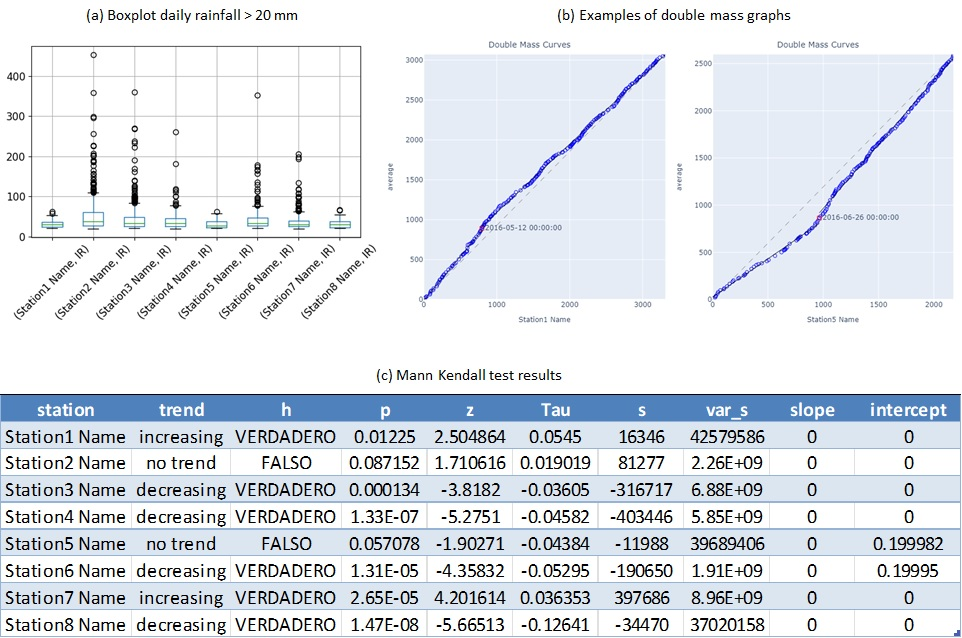
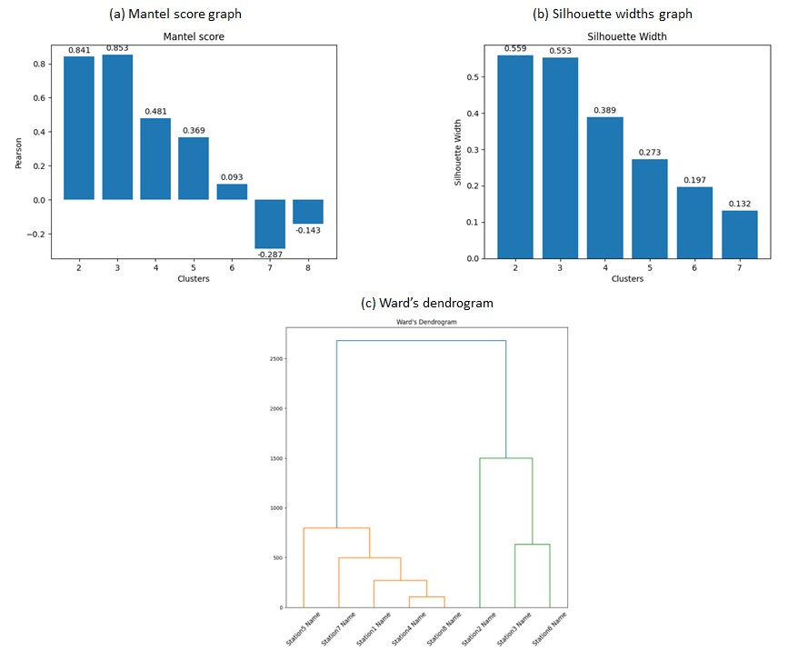

# Summary

Rainfall Frequency Analysis (`RainFA`) is a methodology for data curation and frequency analysis of precipitation series, programmed in `Python`, that allows: (1) homogenization of the temporal step; (2) performing data quality control; (3) determining homogeneous regions using the L-moments method from a prior process of clusters supported by the Silhouette width and Mantel statistics, as well as Ward's dendrogram; and (4) calculation of the L-moments candidates for homogeneous regions according to the Discordancy and Heterogeneity measures.

`RainFA` is structured in different modules implemented in `Jupyter Notebooks`, which makes it easy to extend and diversify the methodology in future developments.

Further work will focus on extending the methodology to improve the geospatial and temporal distribution of precipitation in homogeneous regions by incorporating new tools into the `RainFA` gallery.

# Statement of need

Rainfall frequency analysis from meteorological gauging stations depends on both the quality of the data and the length of the historical series. Despite the importance of regional frequency analysis for individual records [@Cassalhoetal2019], the lack of long registers limits the robustness of statistical data treatment [@Rahmanetal2013].

The use of neighbouring stations for data completion and quality control is very extensive, thus requiring long data series with few missing registers and a significant overlap of information with the challenged data [@Serrano-Notivolietal2017].

The accuracy of the information can be significantly improved by performing a regional frequency analysis [@Cassalhoetal2019; @HoskingyWallis1997] and using data from neighbouring stations to complete the series information. `RainFA` uses the L-moments method for statistical analysis [@Rahmanetal2013; @HoskingyWallis1997; @Malekinezhad2014; @Kjeldsenetal2002; @Vivekanandan2015] because it presents the following advantages, as they are [@Cassalhoetal2019]: (1) more robust in the presence of outliers; (2) better at distinguishing different probability density functions (PDFs); (3) less subject to estimation bias; and additionally, (4) there are multiple satisfactory case studies around the world.

Furthermore, these hydrological tools and techniques have been widely developed and used in `R` software [@Rahmanetal2013; @Serrano-Notivolietal2017; @Malekinezhad2014; @Diez2017], but are rarely referenced in software developed in `Python`.

`RainFA` has been fully implemented in `Python`, using `Jupyter Notebooks`, and its source code has been archived to GitHub at the following link: https://github.com/vielca/RainFA.

# Performance

## Inputs

* Station data (.csv): a single file including for each station the following data: station ID, station name, WGS84 coordinates (Latitude, Longitude, Elevation). 
* Precipitation time series (.csv): a different file for each gauge station including station ID, date-time and instantaneous rainfall (IR) in mm.

## Calculations

Firstly, data curation and trend testing will help to depurate the rainfall time series. Example results are represented in \autoref{fig:data_curation}.

* Precipitation time-series database (.parquet): Database with the homogeneized time-step date-time and instantaneous rainfall in mm.
* Boxplot graphs (.ipynb): `Jupyter notebook` for the calculation and graphical representation of single station boxplots.
* Double-mass graphs (.ipynb): `Jupyter notebook` for the calculation and graphical representation of single station double-mass graphs against average rainfall data.
* Mann-Kendall test (.ipynb): `Jupyter notebook` for the calculation of the Mann-Kendall trend test and associated statistics to determine the data stationarity.

Next, the following graphs will allow for cluster classification. For this purpose, the station data file is suplemented with two rainfall statistics summarised from the recipitation time series data file - i.e. annual rainfall and number of days with rainfall above 0.2 mm. \autoref{fig:clustering} represents the cluster classification graphics. 

* Mantel graphs (.ipynb): `Jupyter notebook` for the calculation and graphical representation of Mantel graph clustering method.
* Silhouette widths graphs (.ipynb): `Jupyter notebook` for the calculation and graphical representation of Silhouette widths graph clustering method.
* Ward's dendrogram graph (.ipynb): `Jupyter notebook` for the calculation and graphical representation of Ward's dendrogram graph.

Finally, L-moments ratios will allow the homogeneity of a region to be identified. See \autoref{fig:l-moments} for example results:

* L-moments discordancy measure (.ipynb): `Jupyter notebook` for the calculation of the Discordancy measure with L-moments.
* L-moments heterogeneicy measure (.ipynb): `Jupyter notebook` for the calculation of the Heterogeneity measure with L-moments.

Taking into account the clustering results - i.e. Mantel score, Silhouette widths and Ward's dendrogram -, the optimal number of clusters is 2 or 3 and would come from the combination of the following stations: Group 1 (1, 4, 5, 7 and 8), Group 2 (2, 3 and 6).

According to the discordancy measure, none of them are discordant, and so they are all scored for heterogeneity. However, both from the evaluation of all the stations as a single cluster and from the results of Group 1, the heterogeneity improves when Station8 is discarded. This is also the case when Station2 in Group 2 is discarded.

As a final result, Group 1 consists of stations 1, 4, 5 and 7, but is considered `definitely heterogeneous` according to [@HoskingyWallis1997]; and Group 2 consists of stations 3 and 6, and is considered `acceptably homogeneous`.

# Dependencies

`RainFA` is based on various implementations on `Python` for mathematic calculations and graphical representation:

* numpy [@2020NumPy-Array]
* pandas [@the_pandas_development_team_2023_7979740]
* pymannkendall [@Hussain2019]
* statsmodels [@seabold2010statsmodels]
* sklearn [@scikit-learn]
* scipy [@2020SciPy-NMeth]
* lmoments3 [@Hollebrandse2015]
* matplotlib [@Hunter:2007]

# Acknowledgements

Authors acknowledge Vicente M. Candela Canales for supporting the R&D investment and programs within the Vielca companies.

# References
